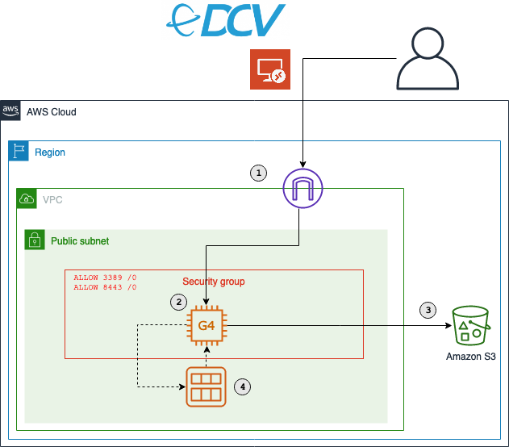

# Discover sensitive data in AWS CodeCommit

This repository contains the full source code that is used in the blog post [<TODO>](XXX).

## Solution Overview



### Prerequisites

- An [AWS account](https://signin.aws.amazon.com/signin?redirect_uri=https%3A%2F%2Fportal.aws.amazon.com%2Fbilling%2Fsignup%2Fresume&client_id=signup)
- Installed and authenticated [AWS CLI](https://docs.aws.amazon.com/en_pv/cli/latest/userguide/cli-chap-install.html) (authenticate with an [IAM](https://docs.aws.amazon.com/IAM/latest/UserGuide/getting-started.html) user or an [AWS STS](https://docs.aws.amazon.com/STS/latest/APIReference/Welcome.html) Security Token)
- Installed and setup [AWS Cloud Development Kit (AWS CDK)](https://docs.aws.amazon.com/cdk/latest/guide/getting_started.html)
- Installed Node.js, TypeScript and git


### Let’s get you started

#### 1. Make sure you completed the prerequisites above and cloned this repo.

```
git clone git@github.com:aws-samples/xxx
```

#### 2. Open the repository in your preferred IDE and familiarize yourself with the structure of the project.

```
.
├── cdk             CDK code that defines the environment
└── img             Images used in this README
```


#### 3. Install dependencies

node.js dependencies are declared in a `package.json`.
This project contains a `package.json` file in the `cdk` folder. Navigate into it and run `npm install`

#### 4. Configure your environment

Before you can deploy the stack, you need to review the config. Navigate to `cdk/bin/cloud-gaming-on-ec2.ts` and review / update the following parameters:

- `account`: The account id you want to deploy the stack in
- `region`: The region you want to deploy the stack in
- `niceDCVDisplayDriverUrl`: The download URL of the NICE DCV Virtual Display Driver for EC2. You can leave this unless the link is broken or you want to use a different version.
 - `niceDCVServerUrl`: The download URL of the NICE DCV 2021.0 Server. You can leave this unless the link is broken or you want to use a different version.
- `instanceSize`: Sets the size of the EC2. Defaults to `g4dn.xlarge` and `g4ad.4xlarge` respectively.
- `associateElasticIp`: Controls if an Elastic IP address will be created and added to the EC2 instance.
- `sshKeyName`: The name of the EC2 key pair you will use to connect to the instance. Make sure to have access to the respective .pem file.
- `volumeSizeGiB`: The size of the root EBS volume. Around 20 GB will be used for the Windows installation, the rest will be available for your software.
- `openPorts`: Access from these ports will be allowed. Per default this will allow access for RDP (3389) and NICE DCV (8443)
- `allowInboundCidr`: Access from this CIDR range will be allowed. Per default this will allow access from /0, but I recommend to restrict this to your IP address only.
- `gridSwCertUrl`: (Only for g4dn instances) The NVIDIA driver requires a certificate file which can be downloaded from Amazon S3. You can leave this unless the link is broken or you want to use a different certificate.
- `tags`: A list of resource tags that will be added to every taggable resource in the stack.


#### 5. Transpile TypeScript to JavaScript

The CDK code is written in TypeScript, an extension to JavaScript that adds static types and other useful features.

To run the CDK code, we need to transpile TypeScript into JavaScript by running `npm run build` in the `cdk` folder. This will transpile the code once - if you want to keep watching the code for changes and automatically transpile after a change, run `npm run watch`

#### 6. Deploy your application

Navigate to the `cdk` folder and run the following commands

```
cdk synth 
cdk bootstrap
cdk deploy <StackName>
```

`cdk synth` will synthesize a CloudFormation template from your CDK code. After bootstrapping the required resources for the CDK with `cdk bootstrap` you can then deploy the template with `cdk deploy <StackName>`.

`<StackName>` can be either `CloudGamingOnG4DN` or `CloudGamingOnG4AD`, depending on the instance type you want to use.

#### 8. Create your personal gaming AMI

Follow the instructions in the associated blog post [<ADD AFTER PUBLISHED](XXXX). 


## Useful CLI commands

List EC2 key pairs

```
aws ec2 describe-key-pairs --query 'KeyPairs[*].KeyName' --output table
```
Create a new key pair and the PEM file to store your private key
```
KEY_NAME=GamingOnEc2
aws ec2 create-key-pair --key-name $KEY_NAME --query 'KeyMaterial' --output text > $KEY_NAME.pem
```

Start / Stop an EC2 instance
```
aws ec2 start-instances --instance-ids INSTANCE_ID
aws ec2 stop-instances --instance-ids INSTANCE_ID
```

Creates an Amazon Machine Image from an EC2 instance
```
aws ec2 create-image --instance-id <YOUR_INSTANCE_ID> --name <THE_NAME_OF_YOUR_AMI>
```

Starts a new EC2 instance from a launch template
```
aws ec2 run-instances --image-id <YOUR_AMI_ID> --launch-template LaunchTemplateName=<LAUNCH_TEMPLATE_NAME> --query "Instances[*].[InstanceId, PublicIpAddress]" --output table
```

List your instances
```
aws ec2 describe-instances --query "Reservations[*].Instances[*].[ImageId, InstanceType, VpcId, State.Name, PublicIpAddress, LaunchTime]" --output table
```


## Security

See [CONTRIBUTING](CONTRIBUTING.md#security-issue-notifications) for more information.

## License

This library is licensed under the MIT-0 License. See the LICENSE file.
